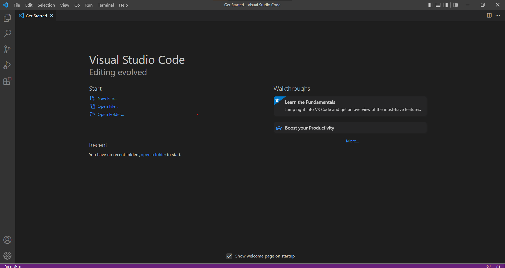
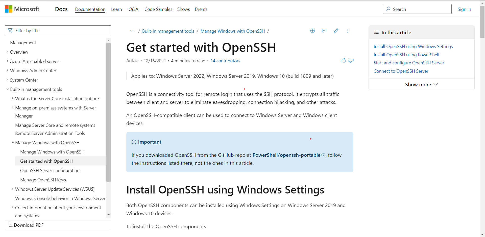
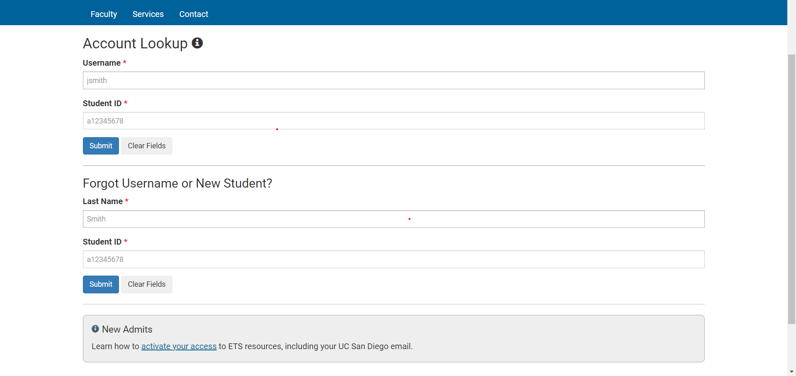
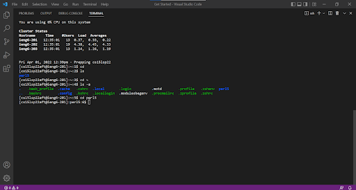
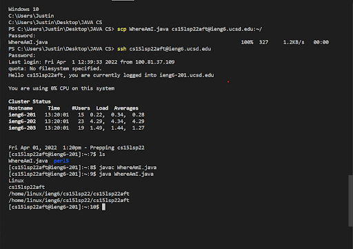
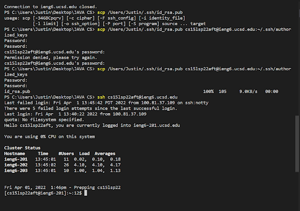

# Welcome students to CSE 15L!!!

## Let's learn about remote acessing!


> Step 1. Installing VScode


In order to even start remotely accessing a computer for this course, we must first install VScode. VScode is the code editor we will be using for CSE 15L. Click this link [here](https://code.visualstudio.com/?msclkid=6130e873bab411ecadfb4070996f01ad) to download the suggested editor.

Once you click the link provided and download VScode, open it up, your screen should look like this.




>Step 2. Remotely connecting  


To be able to remotely connect to a system in CSE 15L, were first going to need to install Open SSH [here](https://docs.microsoft.com/en-us/windows-server/administration/openssh/openssh_install_firstuse). Open SSH allows our computer to connect to other computers that have an associated account with us. The page of Open SSH should look like this.


Once OpenSSH is downloaded, lets find your account for CSE15L which we will be using for remoting connecting [here](https://sdacs.ucsd.edu/~icc/index.php).
   

After getting our account, lets open up a terminal on VS code using the commands Ctrl + `, and type into the terminal  

`ssh cs15lsp22zz@ieng6.ucsd.edu` but replace the `zz` with the characters in your course-specific account.  

After typing `ssh cs15lsp22zz@ieng6.ucsd.edu`, you should see the following lines of code:  


`The authenticity of host 'ieng6.ucsd.edu (128.54.70.227)' can't be established.`

`RSA key fingerprint is SHA256:ksruYwhnYH+sySHnHAtLUHngrPEyZTDl/1x99wUQcec.`

`Are you sure you want to continue connecting (yes/no/[fingerprint])?`

Type in `yes` if this is your first time connecting to the server and press enter. Then, tpye in your password. A visual of this process is shown here:

`ssh cs15lsp22zz@ieng6.ucsd.edu`  

`The authenticity of host 'ieng6-202.ucsd.edu (128.54.70.227)' can't be established.` 

`RSA key fingerprint is SHA256:ksruYwhnYH+sySHnHAtLUHngrPEyZTDl/1x99wUQcec.`

`Are you sure you want to continue connecting (yes/no/[fingerprint])? `

`Password:` 

`Last login: Sun Jan  2 14:03:05 2022 from 107-217-10-235.lightspeed.sndgca.sbcglobal.net`

`quota: No filesystem specified.`

`Hello cs15lsp22zz, you are currently logged into ieng6-203.ucsd.edu`

>Step 3: Trying Some Commands  

Now that were remotely connected to a computer, lets try running some commands such as:  

-`cd ~`

-`cd`

-`ls -lat`

-`ls -a`

-`ls <directory>` where ` <directory>` is `/home/linux/ieng6/cs15lsp22/cs15lsp22abc`, where the `abc`  is one of the other group members’ username

-`cp /home/linux/ieng6/cs15lsp22/public/hello.txt ~/`

-`cat /home/linux/ieng6/cs15lsp22/public/hello.txt`

Here is an example of some commands being run:
  


>Step 4: Moving Files with `scp`

Now that we can remotely access computers, lets learn how to move files with scp.
It should be **Noted** that scp will be always run our local computer or our own computer, not the remote computer.

First, lets create a file called `WhereAmI.java` with the following contents:

```
class WhereAmI {
  public static void main(String[] args) {
    System.out.println(System.getProperty("os.name"));
    System.out.println(System.getProperty("user.name"));
    System.out.println(System.getProperty("user.home"));
    System.out.println(System.getProperty("user.dir"));
  }
}
```
After running it using `javac` and `java` on your local computer, go to the directory where this file was made and run the following command.

```
scp WhereAmI.java cs15lsp22zz@ieng6.ucsd.edu:~/
```
Now log into your account associated with CSE15L but now use `ls` to see the file in the home directly of the remote computer. You can now run this file on the remote computer using `javac` and `java`.

Your screen should look something like this:


>Step 5: Setting an SSH key

To streamline the process of remotely acessing a computer, we can create  `ssh` keys. A program called `ssh-keygen` creates a pair of files hat serves as a public and private key. Then, using the  `ssh` command we can use the pair of files in lieu of your pasword.

To set this up, you shold run these lines of code.

```
# on client (your computer)

$ ssh-keygen

Generating public/private rsa key pair.

Enter file in which to save the key (/Users/<user-name>/.ssh/id_rsa): /Users/<user-name>/.ssh/id_rsa

Enter passphrase (empty for no passphrase): 

NOTE: DO NOT ADD A PASSPHRASE FOR THIS STEP.

Enter same passphrase again: 

Your identification has been saved in /Users/<user-name>/.ssh/id_rsa.

Your public key has been saved in /Users/<user-name>/.ssh/id_rsa.pub.

The key fingerprint is:
SHA256:jZaZH6fI8E2I1D35hnvGeBePQ4ELOf2Ge+G0XknoXp0 <user-name>@<system>.local

The key's randomart image is:
+---[RSA 3072]----+
|                 |
|       . . + .   |
|      . . B o .  |
|     . . B * +.. |
|      o S = *.B. |
|       = = O.*.*+|
|        + * *.BE+|
|           +.+.o |
|             ..  |
+----[SHA256]-----+
```

Heres what it should look like on your screen:



 If you're on Windows, you should type into your terminal 
 ```
  ssh-keygen -t ed25519
```

Now that we created two files on our computer each representing a key with the private key being `id_rsa` and the public being `id_sa.pub` stored in `.ssh` directory on said computer, type in the following code.

```
$ ssh cs15lsp22zz@ieng6.ucsd.edu

<Enter Password>

# now on server

$ mkdir .ssh

$ <logout>

# back on client

$ scp /Users/<user-name>/.ssh/id_rsa.pub cs15lsp22zz@ieng6.ucsd.edu:~/.ssh/authorized_keys

# You use your username and the path you saw in the command above
```
Once this is done, you are now able to `ssh`/`scp` from this computer to the remote without the need of entering your password.

>Step 6: Optimizing Remote Running
We can Optimize our remote running by:

1. Writing a given command in quotes at the end of a commnd given by the ssh function.

2. Using Semicolons to run multiple commands.

3. Using the up arrow key to recall the computers last command given.


 


