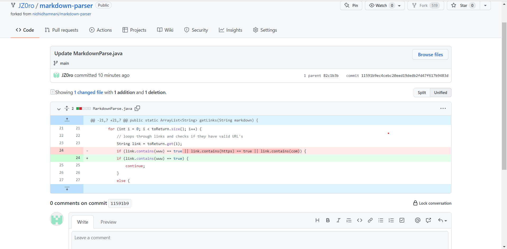
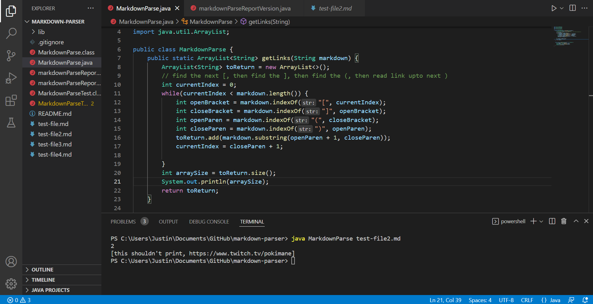
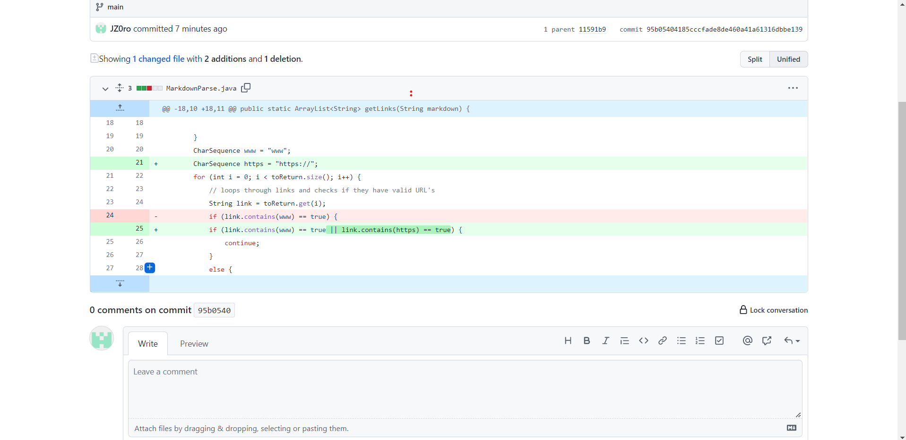
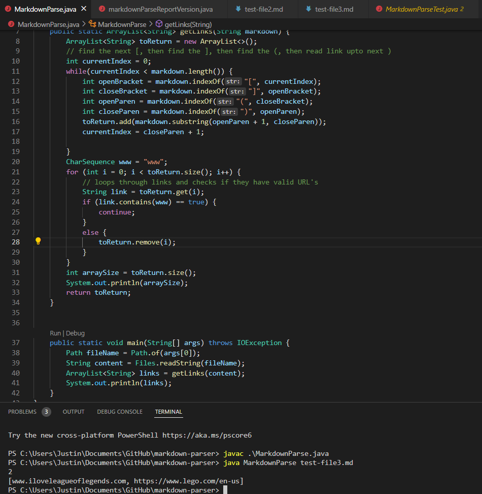
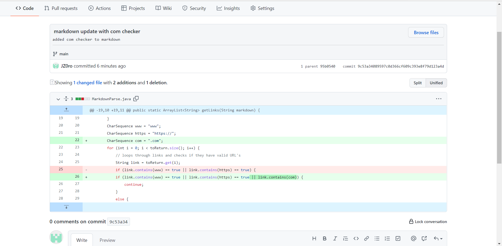
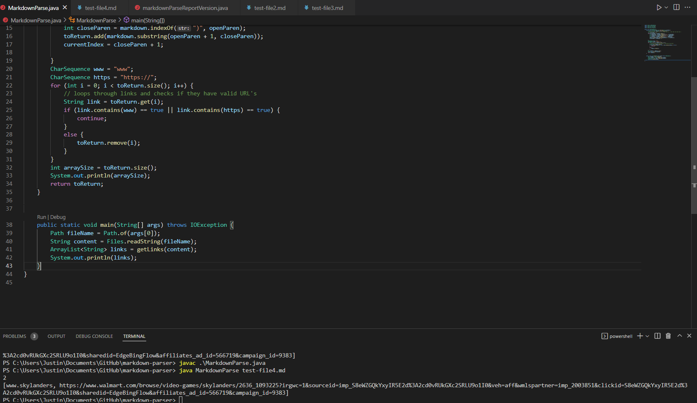

# Lab Report 2, Week 4!

## Code changes made during Lab 3 and their relationships!!!

> Change 1. 

(Note, in the deletion line you of this screenshot you will see the three changes I made on the parser file. I made all the changes on the parser file at the same time hence why they are on the same line.)  

[Link](https://github.com/JZ0ro/markdown-parser/blob/main/test-file2.md?plain=1) to the test file that prompted a **failure-inducing input**

Symptom of *failure-inducng input* 

Why was this output being printed? 

The link given in the test file without a character sequence of www was a failure-inducing input which caused the symptom of this incorrect link being printed in the main method. This was caused by our algorithm not checking if our links given in the test file had a character sequence of www which was our bug.  
  

> Change 2.  

[Link](https://github.com/JZ0ro/markdown-parser/blob/main/test-file3.md) to the test file that prompted a **failure-inducing input**

Symptom of *failure-inducng input* 

Why was this output being printed? 

The link given in the test file without a character sequence of https:// was a failure-inducing input which caused the symptom of this incorrect link being printed in the main method. This was caused by our algorithm not checking if our links given in the test file had a character sequence of https:// which was our bug.    

> Change 3.

[Link](https://github.com/JZ0ro/markdown-parser/blob/main/test-file4.md) to the test file that prompted a **failure-inducing input**

Symptom of *failure-inducng input*

Why was this output being printed? 

The link given in the test file without a character sequence of .com was a failure-inducing input which caused the symptom of this incorrect link being printed in the main method. This was caused by our algorithm not checking if our links given in the test file had a character sequence of .com which was our bug.

