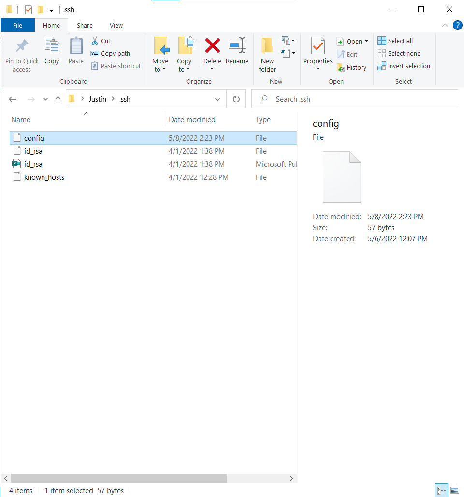
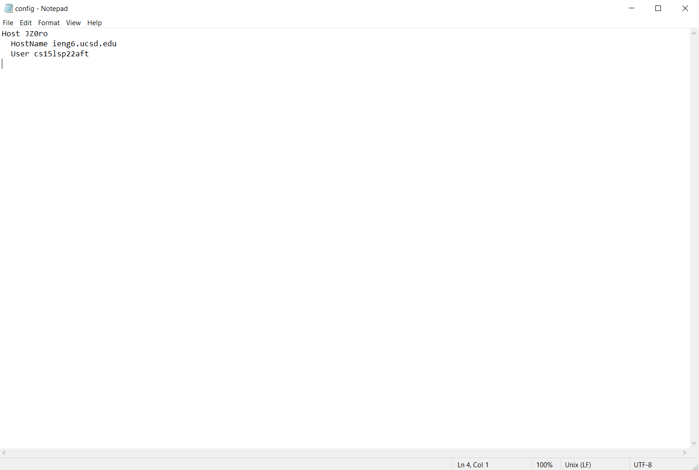

# Lab report 3, Week 6!

## Group Choice Options from Lab 5.

> 1. Streamlining ssh Configuration

* My .ssh/config file:   

* This .ssh/config file was edited using notepad as shown here:

* Utilizing the ssh command to log into my account: 
