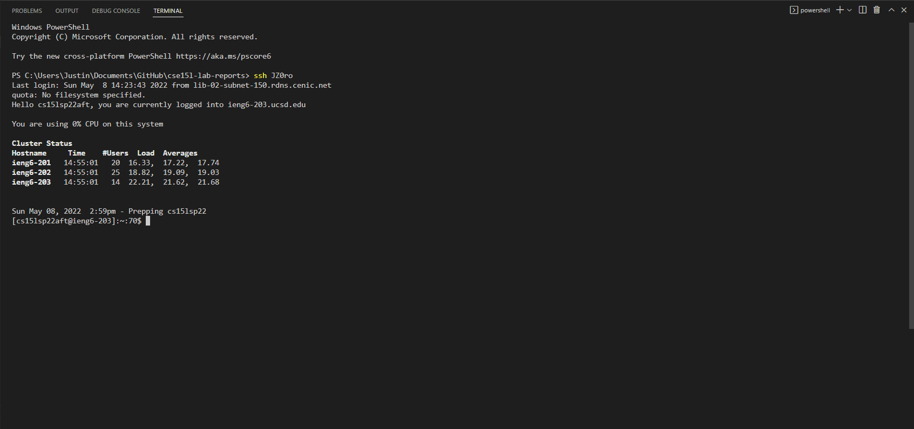

# Lab report 3, Week 6!

## Group Choice Options from Lab 5.

> 1. Streamlining ssh Configuration
    
To begin streaming lining the SSH configuration process, we had to first make an SSH file.
* My .ssh/config file:   

* This .ssh/config file was edited using notepad as shown here:

With our SSH file created with the appropriate login information, we can simply use the ssh command along with the alias chose to log into our remote account and to copy
* Utilizing the ssh command to log into my account: 

* Copying a file into my account using an Alias   

> 2. Setting up Github Access from ieng6
We can provide access to Github from our ieng6 account via a SSH key which not only allows us to access Github from our ieng6 account but also eliminate the need to enter our password when sshing into a client.

* Public key made and stored on Github:

*  Key in ieng6 account:
