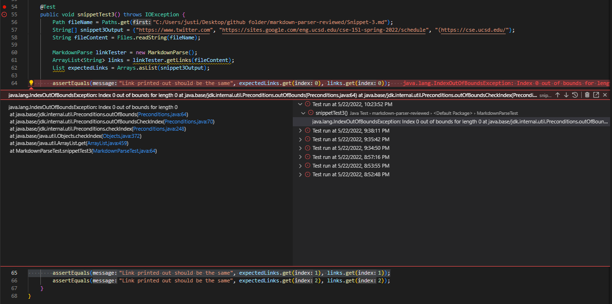

# Lab Report 4, Week 8!

## Code Snippets and their results

> Links to the reviewed repository and mine

 - [Reviewed repo](https://github.com/gabrielseventhucsd25/markdown-parser)

- [My repo](https://github.com/JZ0ro/markdown-parser)

- Tool used to determine if string in snippet md is a link: VSCode preview

>Snippet 1
  
  When Snippet 1 is run through my tester method on my personal repo
  of markdown-parser, the following links should be outputted
  
  - "`google.com", "google.com", "ucsd.edu"`

  
**Test for snippet 1 on my repo of mark-downparser and results**
  - 
  
  - 

**Test for snippet 1 on the implementation reviewed in week 7 lab and results**
  - 
 
  - 

**Do you think there is a small (<10 lines) code change that will make your program work for snippet 1 and all related cases that use inline code with backticks?**
- I suspect that a small code change will be inadequate to make my program work for snippet 1 as a memory exception is thrown before my program can compare its output to the expected output. Because my program is running out of memory before a comparison can be made, my implementation of the parser file as a whole needs to be considered as my previous test md files were capable of being compared however the snippet md files were not. I suspect it is due to how I implemented my loops and the instanctiation of objects and variables.

  

  
>Snippet 2

When Snippet 2 is run through my tester method on my personal repo
  of markdown-parser, the following links should be outputted
 
  - `"a.com", "a.com(())", "example.com"`

**Test for snippet 2 on my repo of mark-downparser and results**
- 

- 

**Test for snippet 2 on the implementation reviewed in week 7 lab and results**
- 

- 

**Do you think there is a small (<10 lines) code change that will make your program work for snippet 2 and all related cases that nest parentheses, brackets, and escaped brackets? If yes, describe the code change. If not, describe why it would be a more involved change.**
 - I suspect that a small code change will be inadequate to make my program work for snippet 2 as a memory exception is thrown before my program can compare its output to the expected output. Because my program is running out of memory before a comparison can be made, my implementation of the parser file as a whole needs to be considered as my previous test md files were capable of being compared however the snippet md files were not. I suspect it is due to how I implemented my loops and the instanctiation of objects and variables.

 >Snippet 3
 
 When Snippet 3 is run through my tester method on my personal repo
 of markdown-parser, the following links should be outputted
 
 - `"https://www.twitter.com", "https://sites.google.com/eng.ucsd.edu/cse-15l-spring-2022/schedule", "(https://cse.ucsd.edu/"`

 **Test for snippet 3 on my repo of mark-downparser and results**
 - 
 
 - 

 **Test for snippet 3 on the implementation reviewed in week 7 lab and results**
 - 

 - 

**Do you think there is a small (<10 lines) code change that will make your program work for snippet 3 and all related cases that have newlines in brackets and parentheses? If yes, describe the code change. If not, describe why it would be a more involved change.**
-I suspect that a small code change will be inadequate to make my program work for snippet 3 as a memory exception is thrown before my program can compare its output to the expected output. Because my program is running out of memory before a comparison can be made, my implementation of the parser file as a whole needs to be considered as my previous test md files were capable of being compared however the snippet md files were not. I suspect it is due to how I implemented my loops and the instanctiation of objects and variables.

