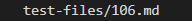
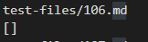
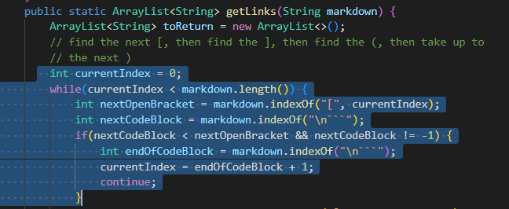
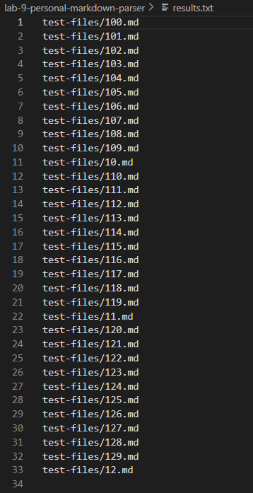
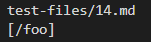
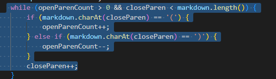

# Lab Report 5, Week 10

## Tests that had different outputs than implementation provided for lab 9.

  
  
  > **Test 1**   
   
   How did you find the tests with different results?
   * I used vimdiff on the results running a bash for loop and looked at results.txt file, comparing the outputs of my parserfile to implementation provided in lab 9
     
     
   

Link to the test-file with different-results: [test-file/106.md](https://github.com/nidhidhamnani/markdown-parser/blob/main/test-files/106.md)

Which implementation is correct? **The provided implementation for lab 9**
* My implementation of the parser file is incorrect. My personal parser file provided just the file name: `test-files/106` in lieu of an empty arrayList. The provided implementation is correct as an empty arraylist is returned.

* Output of my parser file: 
* Output of given implementation of parser file: 

* Expected output of test 1: `[]`

What is most likely the bug in my code?

* Most likely the issue is that my program is failing to account for test cases when there is no brackets or paranthesis. Crucial variables such as nextOpenBracket and nextCodeBlock cannot be instantiated with values when brackets or paranthesis are not found in the md file.

> **Test 2**

How did you find the tests with different results?
   * I used vimdiff on the results running a bash for loop and looked at results.txt file, comparing the outputs of my parserfile to implementation provided in lab 9

Link to the test-file with different-results: [test-file/14.md](https://github.com/nidhidhamnani/markdown-parser/blob/main/test-files/14.md)

Which implementation is correct? **Neither**
* Neither implementation was correct as my implementation didn't even give read test-file 14 and the given implementation by the lab printed out a a string of letters, not a link

* Output of my parser file: 
(Notice how test-file 14 is not accounted for)
* Output of given parser file 
* Expected output of test 2: `[]`

What is most likely the bug in the parser file provided in lab 9?

* The lab implementation is not accounting for cases where the data inside the paranthesis is not indicative of a valid link. Here we can see that the labs parser file copies whatever is in paranthesis and outputs the info in said paranthesis as a link. If the while loop accounted for this by checking if a valid address was in the paranthesis like www. or .com, errors such as the one mentioned would occur much less.